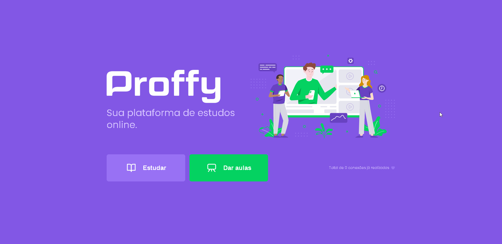

<h1 align="center">
  
</h1>

 

<h2 align="center">Full Stack application 📟 👨‍💻</h2>

<h3 align="center">Application that unites teachers and students on an online platform</h3>

<h4>In addition to the application developed, I added more materials for classes, some animations to the layout, dark theme and registration page performed after submitting the form</h4>

# **Web Layout** 💻

  

 

# **Mobile Layout** 💻

  

 

<h3 align="center"> 
	 Application status: Developed ✔️
</h3>
 

## :star: Features
- [x] Teacher registration
- [x] Search for specific classes on specific dates
- [x] Class schedule

## :rocket: Technologies used:

 

## :information_source: Application installation
- `git clone https://github.com/mathwcruz/Proffy_OS_NLW_02.git` to clone the repository

 

# Frontend
To run the application on the web, follow the instructions:
- Go to `web` folder
- run `npm i` or `yarn install` to install project dependencies
- After downloading the dependencies, run `npm start` or `yarn start` para start the application
- Link to the [web application](https://proffy-matheus-cruz.netlify.app/) - You need to run the server to enjoy the application as much as possible.

 

# Backend
To run the server, follow the instructions:
- Entre na pasta `server`
- run `npm i` or `yarn install` to install project dependencies
- After downloading the dependencies, run `npm start` or `yarn start` to start the server

 

### Author
---

<a href="https://app.rocketseat.com.br/me/matheus-da-cruz-frontend">
 
  
 <b>Matheus da Cruz</b></a> <a href="https://app.rocketseat.com.br/me/matheus-da-cruz-frontend" title="Rocketseat">  🚀</a>

 

 

## **
Starting the walk to be able to participate in the marathon in this programming world 🏃‍
**

<h2 align="center">Another application developed by Matheus da Cruz 👨‍💻 </h2>
